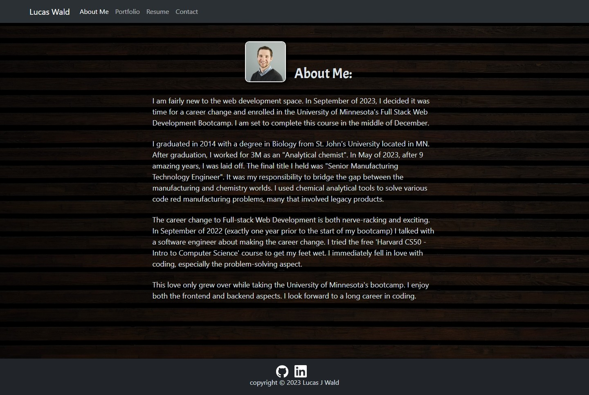
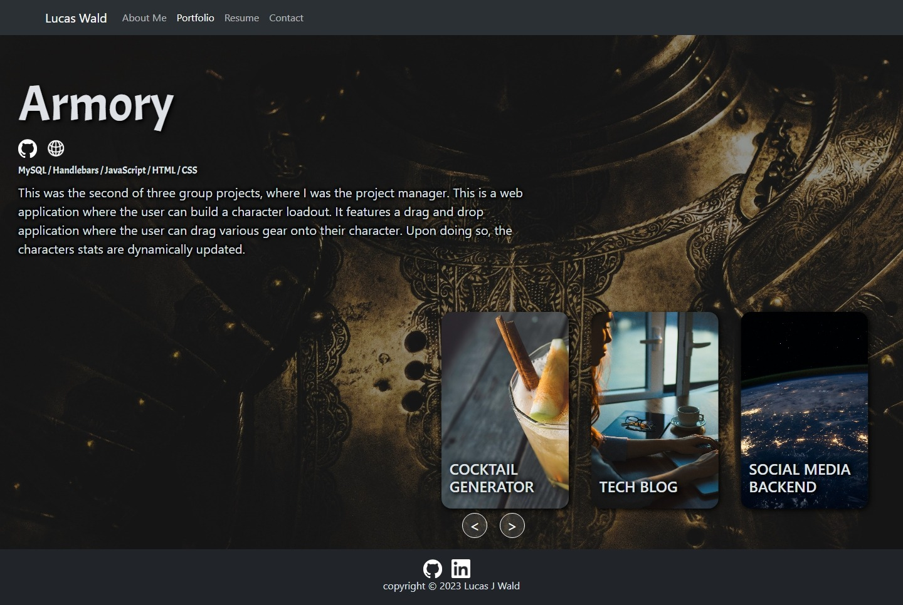
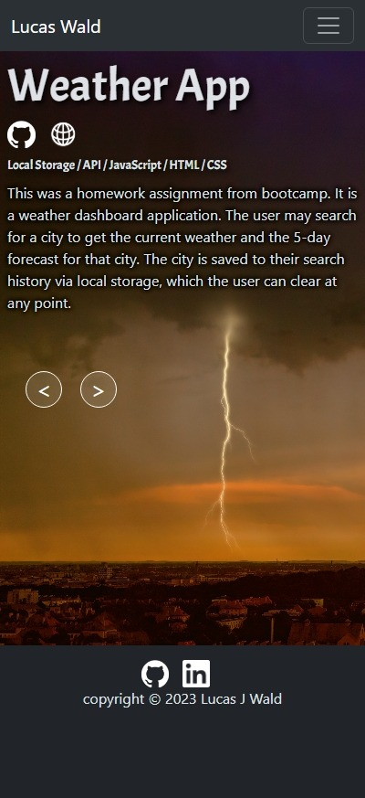
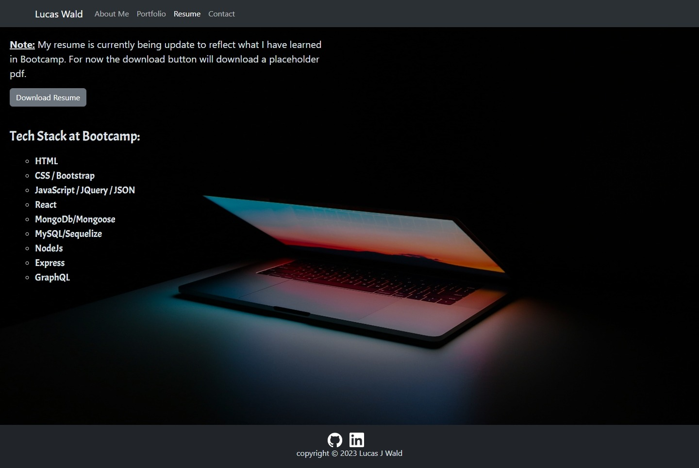
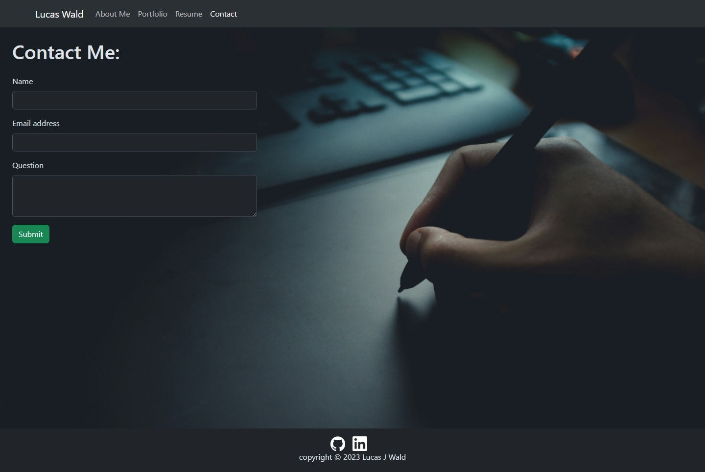

# Portfolio

## Description
This is a portfolio that highlights some of my best coding projects for a potential future employeer to review.

## Table of Contents
- [Usage](#usage)
- [Questions](#questions)
- [Acknowledgements](#acknowledgements)
- [Preview](#preview)

## Usage
Upon arriving to the webpage the user is presented a navigation bar that will take them to the following pages: About Me, Portfolio, Resume, and Contact. By default, the user is directed to the About Me page. At the bottom is a footer that contains links to my GitHub and LinkedIn accounts.

### About Me Page
The About Me page tells employeers a little bit about my coding and work history.

### Lucas Wald's Portfolio
The Portfolio showes off 6 of my top projects. The site can be accessed by here: [Luke Wald's Portfolio](https://luke-wald-portfolio.netlify.app/)

If on a tablet or computer, the user will be presented with a carousel with each project having it's own slide. The user can either use the navigation buttons to advance to the next or prevous project. Additionally, the user can click on a slide and the carousel will advance to that slides web component. As the user advances through the carousel, they'll be presented with that projects information. This includes a header, background on the project, tech stack used, link to GitHub repository, and deployed application. NOTE: For back end projects, there is no deployed application so this icon disappears as an option to click.

When the user is is on a mobile device, the carousel disappears. However, the navigation buttons remain for the user to cycle through the projects.

### Resume
When the user goes to this page, they are presented with a link to download my resume. They also are presented with the tech stack that I learned while at bootcamp.

### Contact
When the user goes to this page, they are presented with a form to contact me. They must enter their name, a valid email, and their question. If they don't, the form will notify the user that they're missing information and those fields will turn red. On a successful submission, the form will reset, and I will recieve an email (via emailjs) with the information the user submitted.

## Questions
Questions can be received on the [Github Repository](https://github.com/Wald14/lucas_wald_portfolio) for this application. Please make a new issue.

## Acknowledgements
- Gary Almes (Professor)
- Ben Martin and Katy Vincent (TA)
- [W3School](https://www.w3schools.com/)
- [MDN Web Docs](https://developer.mozilla.org/)
- [Stack Overflow](https://stackoverflow.com)

## Site Preview
The following image shares the web application's apperance:
 

About Me Page:

Portfolio Page (Computer / Tablet):

Portfolio Page (Mobile):

Resume Page:

Contact Page:
